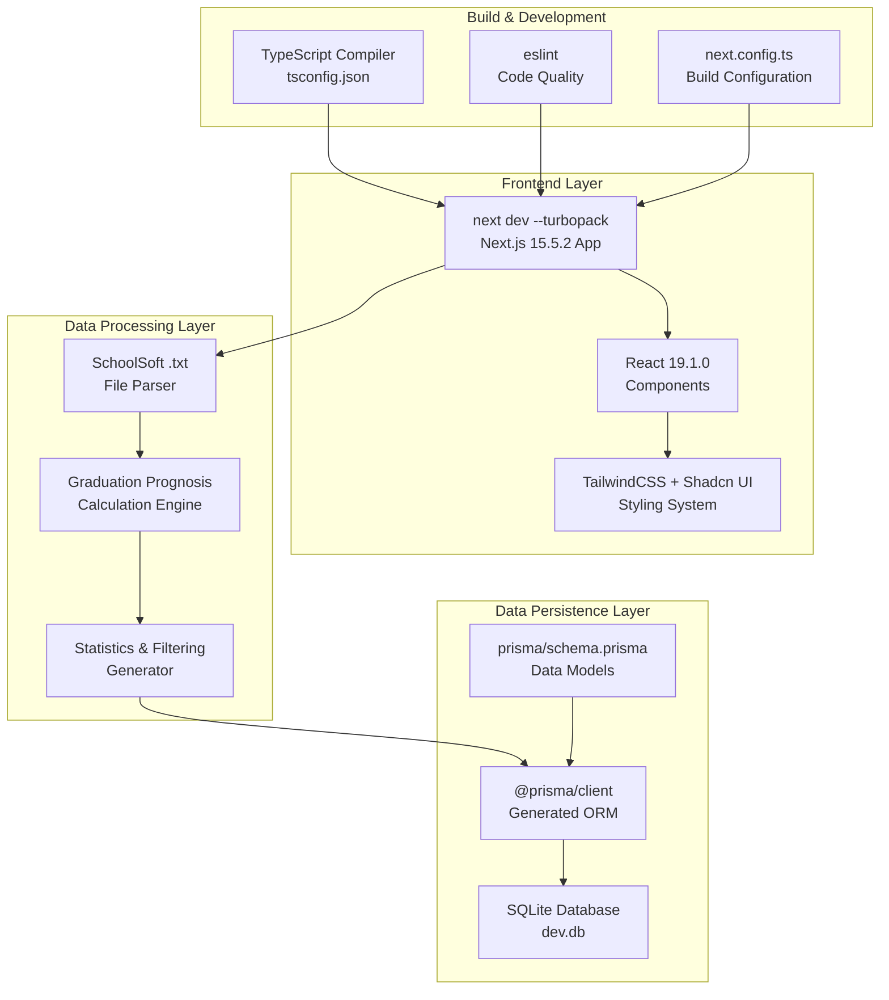

## Project Overview
This project, named `betygsprognos`, is a web interface built with Next.js, Shadcn UI, Prisma, and SQLite.  Its main goal is to provide school administrators ("skolledare") with a local and user-friendly tool to generate graduation prognoses based on data exported from SchoolSoft.  The system processes `.txt` files from SchoolSoft and presents prognoses in a clear and interactive manner.  The target audience is Swedish school administrators. 

## Architecture & Structure
### High-level architecture overview
The `betygsprognos` system is designed as a local-first web application.  It utilizes a modern web architecture built on Next.js 15 with local SQLite storage.  The system processes `.txt` files from SchoolSoft, calculates graduation probabilities, and presents them through a web interface. 

### Key directories and their purposes
The codebase includes the `app/` directory, which likely contains the main application components for the Next.js App Router.  The `lib/` directory contains utility functions, such as `lib/utils.ts` for combining CSS classes.  The `prisma/` directory would contain the Prisma schema definition. 

### Main components and how they interact
The system's components include a frontend built with Next.js and React, a data processing layer with a SchoolSoft file parser and prognosis engine, and a data persistence layer using Prisma and SQLite.  The frontend interacts with the data processing layer, which in turn uses Prisma to store and retrieve data from the SQLite database. 

### Data flow and system design
The data flow begins with users uploading SchoolSoft `.txt` files through the web interface.  These files are parsed, and relevant data is stored locally in an SQLite database via Prisma.  The system then calculates graduation prognoses based on this stored data.  The web interface displays statistics and prognoses, allowing filtering and future export options. 

## Development Setup
### Prerequisites and dependencies
The project requires Node.js 22.  Key dependencies include Next.js 15, React 19, Prisma, and TailwindCSS.  Development dependencies include ESLint and TypeScript. 

### Installation steps
While explicit installation steps are not provided in the given context, typical Next.js project setup involves cloning the repository and installing dependencies using `npm install` or `yarn install`. <cite/>

### Environment configuration
The database configuration uses SQLite, with the client generated to `lib/generated/prisma`.  The `DATABASE_URL` environment variable is used for database connection. 

### How to run the project locally
To run the project in development mode, use `npm run dev`.  This command executes `next dev --turbopack`.  For a production build, use `npm run build`, followed by `npm run start` to serve the application. 

## Code Organization
### Coding standards and conventions
The project uses ESLint for code quality and adheres to TypeScript for strict typing.   TailwindCSS is used for styling, suggesting a utility-first CSS approach. 

### File naming patterns
Based on the provided snippets, Next.js conventions are followed, such as `app/layout.tsx` for root layout and `next.config.ts` for Next.js configuration.  

### Import/export patterns
Standard ES module import/export patterns are used, as seen in `app/layout.tsx` and `lib/utils.ts`.  

### Component structure (if applicable)
The project uses React components and Shadcn UI for its user interface, indicating a component-based architecture.  

## Key Features & Implementation
### Main features and how they're implemented
The core functionalities include importing `.txt` files from SchoolSoft, generating graduation prognoses, and providing a web interface for school administrators. 
- **Import of .txt files**: Users upload SchoolSoft exports, which are parsed and stored locally in an SQLite database. 
- **Generation of graduation prognoses**: The tool calculates the probability of students graduating based on the imported grade data. 
- **Web interface for school administrators**: This interface allows viewing statistics and prognoses, filtering by program, class, and individual students, with planned functionality for exporting results. 

### Important algorithms or business logic
The system includes a "Prognosis Calculator" and "Statistics Engine" as part of its business logic layer, responsible for calculating graduation probabilities and aggregating data. 

### API endpoints (if applicable)
As a local-first application, the system primarily relies on local data processing and does not expose traditional external API endpoints. 

### Database schema (if applicable)
The database schema is defined using Prisma in `prisma/schema.prisma`.  It uses SQLite for local data storage. 

## Testing Strategy
The provided context does not contain information regarding testing frameworks, test file organization, or how to run tests. <cite/>

## Build & Deployment
### Build process and scripts
The build process uses Next.js with Turbopack optimization.  The `npm run build` script executes `next build --turbopack`. 

### Deployment configuration
The application is designed for local deployment, with all data saved locally in SQLite.  This simplifies installation and usage by avoiding external server operations. 

### Environment-specific settings
The primary environment setting is the `DATABASE_URL` for the SQLite database. 

### CI/CD pipeline (if exists)
The provided context does not contain information about a CI/CD pipeline. <cite/>

## Git Workflow
The provided context does not contain information about branching strategy, commit message conventions, code review process, or release process. <cite/>

## Common Patterns & Best Practices
### Recurring code patterns
The `lib/utils.ts` file shows a common pattern for combining CSS classes using `clsx` and `tailwind-merge`, which is typical in TailwindCSS projects. 

### Error handling approach
The provided context does not contain specific information about the error handling approach. <cite/>

### Logging and monitoring
The provided context does not contain specific information about logging and monitoring. <cite/>

### Performance considerations
The use of Next.js with Turbopack indicates a focus on build performance. 

## Dependencies & Tools
### Key dependencies and their purposes
- `next`: Frontend and server components framework. 
- `react`, `react-dom`: UI library for building components. 
- `prisma`, `@prisma/client`: ORM for database modeling and interaction.  
- `tailwindcss`, `@tailwindcss/postcss`: Utility-first CSS framework.  
- `shadcn/ui` (implied by `class-variance-authority`, `clsx`, `tailwind-merge`, `lucide-react`): Pre-built accessible UI components.  
- `typescript`: For strict typing. 

### Development tools and utilities
- `eslint`: For code quality and linting. 
- `ts-node`: For running TypeScript files in Node.js. 

### Package management approach
`npm` is used for package management, as indicated by the `package.json` file and `npm run` scripts. 

## Security Considerations
### Authentication and authorization
The provided context does not contain information about authentication and authorization mechanisms, likely because it's a local-first application without external server dependencies. 

### Data validation patterns
Input validation is implied through the parsing of SchoolSoft format files, ensuring data integrity. 

### Security best practices followed
The primary security consideration is the local storage of all sensitive student data in SQLite, preventing external data transmission and ensuring complete data control.  Type safety with TypeScript and Prisma also contributes to runtime error prevention.

# Development Partnership and How We Should Partner

We build production code together. I handle implementation details while you guide architecture and catch complexity early.

## Core Workflow: Research → Plan → Implement → Validate

**Start every feature with:** "Let me research the codebase and create a plan before implementing."

1. **Research** - Understand existing patterns and architecture
2. **Plan** - Propose approach and verify with you
3. **Implement** - Build with tests and error handling
4. **Validate** - ALWAYS run formatters, linters, and tests after implementation

## Code Organization

**Keep functions small and focused:**
- If you need comments to explain sections, split into functions
- Group related functionality into clear packages
- Prefer many small files over few large ones

## Architecture Principles

**This is always a feature branch:**
- Delete old code completely - no deprecation needed
- No "removed code" or "added this line" comments - just do it

**Prefer explicit over implicit:**
- Clear function names over clever abstractions
- Obvious data flow over hidden magic
- Direct dependencies over service locators

## Maximize Efficiency

**Parallel operations:** Run multiple searches, reads, and greps in single messages
**Multiple agents:** Split complex tasks - one for tests, one for implementation
**Batch similar work:** Group related file edits together

## Problem Solving

**When stuck:** Stop. The simple solution is usually correct.

**When uncertain:** "Let me ultrathink about this architecture."

**When choosing:** "I see approach A (simple) vs B (flexible). Which do you prefer?"

Your redirects prevent over-engineering. When uncertain about implementation, stop and ask for guidance.

## Testing Strategy

**Match testing approach to code complexity:**
- Complex business logic: Write tests first (TDD)
- Simple CRUD operations: Write code first, then tests
- Hot paths: Add benchmarks after implementation

**Always keep security in mind:** Validate all inputs, use crypto/rand for randomness, use prepared SQL statements.

**Performance rule:** Measure before optimizing. No guessing.

## Progress Tracking

- **Use Todo lists** for task management
- **Clear naming** in all code

Focus on maintainable solutions over clever abstractions.

---
Generated using [Sidekick Dev]({REPO_URL}), your coding agent sidekick.
